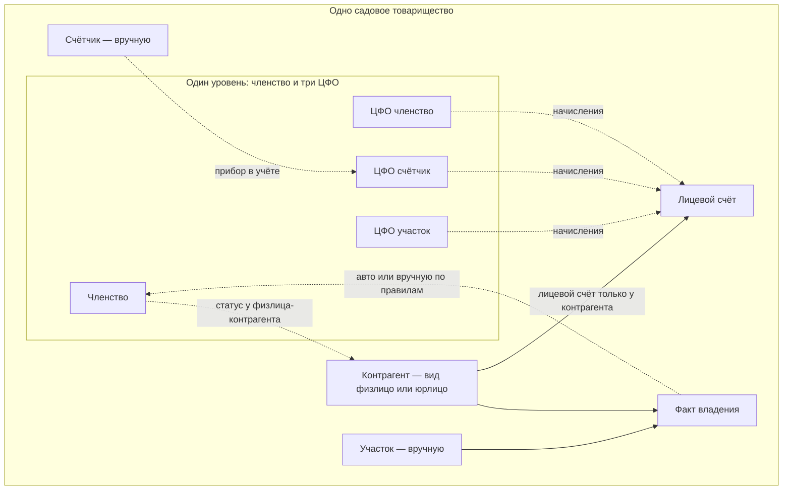
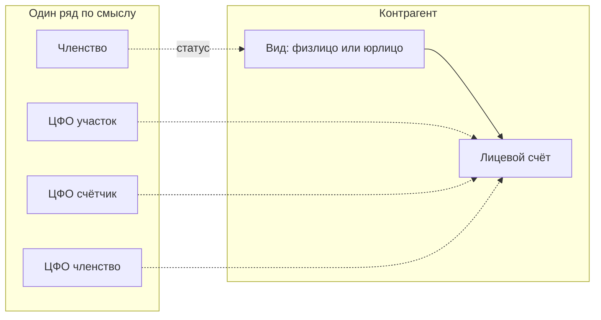
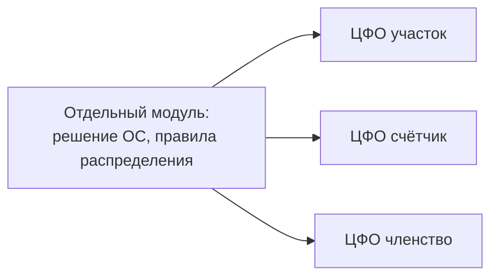
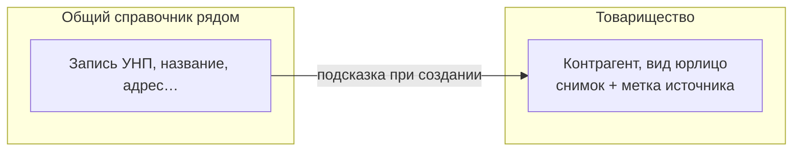

# Заметки по модели: членство, владение, ЦФО, контуры ОС

**Статус:** рабочая фиксация договорённостей с владельцем продукта (апрель 2026).  
**Назначение:** основа для будущего ADR, OpenSpec и миграции данных; не заменяет глоссарии (`docs/architecture/glossary/`) до согласования с Lead Architect.

---

## 1. Контрагент (Counterparty) — одна сущность, два вида

В рамках **одного** товарищества карточка **контрагента** — это **одна** логическая сущность; у неё задаётся **вид**: **физическое лицо** или **юридическое лицо** (как «тип» / «форма» записи). Так проще не плодить разные ветки учёта: и физлицо, и юрлицо — **контрагенты**, с разным видом.

**Лицевой счёт (Personal account)** существует **только у контрагента** (и для физлица, и для юрлица). **Членство** к лицевому счёту **не ведёт отдельной стрелки**: счёт «принадлежит» контрагенту; начисления с **ЦФО** попадают на **лицевой счёт** того контрагента, кому они назначены по правилам.

---

## 2. Что создаётся вручную и что может появиться само

| Сущность | Как появляется |
|----------|----------------|
| **Участок (Land plot)** | **Вручную** (карточка участка в товариществе). |
| **Контрагент (Counterparty)** | **Вручную**: создаётся карточка и выбирается **вид** — физлицо или юрлицо (в рамках **этого** товарищества). |
| **Счётчик (Meter)** | **Вручную** (прибор на учёте; физически стоит на участке, в учёте — отдельный объект). |
| **Факт владения участком (Plot ownership)** | Оформляется **документом/действием**; создаёт **связь** участок ↔ **контрагент(ы)** (любой вид), доля, сроки, признак **основного** владельца. |
| **Членство (Membership)** | **Автоматически** при появлении **факта владения**, когда выполняются правила (например, основной владелец — **контрагент с видом физлицо**), **и/или вручную** (если казначей заводит или корректирует по процедуре). |

---

## 3. Разграничение товариществ

- Данные одного **садового товарищества (Cooperative)** не смыкаются с другим: та же фамилия или тот же УНП в другом СТ — **другие записи**, изоляция на уровне доступа к данным (в т.ч. RLS).
- **Общий справочник** (госорганы и т.п.) — **сбоку**: подсказка при вводе; в СТ хранится **снимок** реквизитов + **метка источника** (идентификатор строки справочника), чтобы предлагать обновить адрес / отметить ликвидацию.

---

## 4. Членство и виды контрагентов

- **Членом** может быть только **контрагент с видом физическое лицо**. **Контрагент с видом юридическое лицо** **членом быть не может**.
- Повторное вступление после полного выбытия — **новая запись** членства (аналог «нового трудоустройства»).
- В одном СТ у одного **контрагента-физлица** — **не больше одного активного** членства.
- **Член без участка не бывает** (по закону): членство связано с **фактом владения**; **основной владелец участка** — тот, через кого ведётся связь с членством (как в текущей логике «основной владелец»).
- **Прекращение членства** по смыслу учёта — не в момент «договорились продать», а когда **другой** человек **занял место** владельца по участку в учёте; участок **не бывает «ни у кого»** в данных.
- Участок **только у контрагента-юрлица**, контрагента-физлица среди владельцев нет: **членства нет**; для площади — статус участка **«не участвует / не учитывать»** (вручную); расчёт по счётчикам — **тот же механизм**, долги вешаются на **лицевые счета** соответствующих **контрагентов** по правилам; рассинхрон «владелец счётчика» vs «основной владелец участка» — **не жёсткая блокировка** системы, риск перепутать лечится процессом и комментариями.

**Членство** и **три ЦФО** (участок, счётчик, членство как финансовый контур) — **на одном концептуальном уровне**: это **разные** «роли/контура» учёта, а не «членство выше или ниже ЦФО». Лицевой счёт при этом **одна привязка** — к **контрагенту**.

---

## 5. Три центра финансовой ответственности (ЦФО)

**Четвёртый тип ЦФО не вводим.** В ядре — **три равноправных по уровню концепции** ЦФО:

1. **ЦФО «участок»** — начисления, завязанные на землю/площадь (в т.ч. то, что относите к участку).
2. **ЦФО «счётчик»** — начисления по прибору учёта; **не сливается** с участком в одну сущность учёта.
3. **ЦФО «членство»** — начисления **членского взноса** и прочего, что относите к **членству**, а не к площади участка.

**Лицевой счёт (Personal account)** — у **контрагента** (любой **вид**).

---

## 6. Отдельный контур: решения общего собрания (ОС)

- Распределение сумм по решению ОС («на площадь», «на членство», «на факт владения» и т.д.) — **отдельный модуль/контур**.
- На **выходе** — готовые строки начислений **только на три ЦФО** выше; ядро не разрастается новыми типами ЦФО.

---

## 7. Операции и роли

- **У каждой операции** в системе — **обязательный комментарий**.
- **Списание долгов**, **закрытие счёта** бывшего члена и аналогичные исключительные действия — в зоне **казначея** (как договорено).

---

## 8. Схемы (Mermaid)

### 8.1. Контрагент, лицевой счёт, владение, членство и три ЦФО на одном уровне

**Как читать:** **Контрагент** — одна карточка, **вид** задаёт, физлицо это или юрлицо. **Лицевой счёт** висит **только** на контрагенте (стрелка **Контрагент → Лицевой счёт**). **Членство** и **три ЦФО** сидят **в одном ряду** по смыслу: это разные контура учёта. От **факта владения** к **членству** — пунктир «появилась запись по правилам»; от **членства** к **контрагенту** — «статус привязан к физлицу-контрагенту», **не** к лицевому счёту. **Начисления** с каждого ЦФО идут на **лицевой счёт** (на того контрагента, кому правила назначили долг).

### 8.2. Упрощённо: кто к кому цепляется

### 8.3. Модуль решений ОС — только на три ЦФО

### 8.4. Общий справочник и контрагент с видом юрлицо

---

## 9. Следующие шаги (для проектирования)

- Согласовать с **Lead Architect** термины в глоссариях и расхождение с текущей моделью `Owner` / `Member` / `FinancialSubject` в коде.
- Оформить **ADR** и при необходимости **OpenSpec change** на миграцию схемы и API.
- Детализировать контракт **вход/выход** модуля ОС (типы начислений, ссылки на ЦФО, комментарии).

---

*Документ можно открыть в GitHub или в любом редакторе с поддержкой Mermaid; онлайн: [Mermaid Live Editor](https://mermaid.live).*
